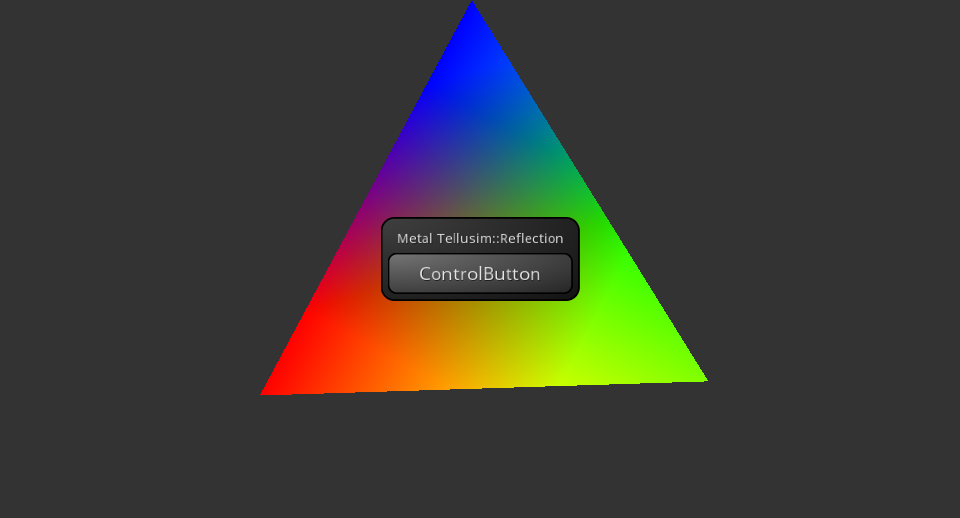

# [Tellusim Core SDK Plugins](https://tellusim.com/core-sdk/)

Some of Tellusim Core SDK plugins

C++, C#, Rust, Python, Swift, Java, Kotlin

Direct3D12, Direct3D11, Metal, Vulkan, OpenGL, OpenGLES, WebGL, WebGPU

Windows, Linux, macOS, Android, iOS, Web

https://tellusim.com/

---

## C++ API Reflection

This plugin enables reflection support for C++ API.

https://github.com/Tellusim/Plugins/tree/main/system/reflection/

---

## Native Cuda driver API

Create dynamic geometry with Cuda and render with Vulkan / Direct3D / OpenGL.

https://github.com/Tellusim/Plugins/tree/main/platform/cuda/

---

## Native Vulkan runtime

You can use this plugin to write applications with native Vulkan API. All Tellusim platform classes give access to internal Vulkan handlers and can be used in Vulkan API calls.

https://github.com/Tellusim/Plugins/tree/main/platform/vulkan/

---

## Native OpenGL runtime

This plugin provides access to all OpenGL core functions. OpenGL API calls can be utilized when necessary.

https://github.com/Tellusim/Plugins/tree/main/platform/opengl/

---

## Native OpenGLES runtime

This plugin provides access to all OpenGLES core functions. OpenGLES API calls can be utilized when necessary.

https://github.com/Tellusim/Plugins/tree/main/platform/opengles/

